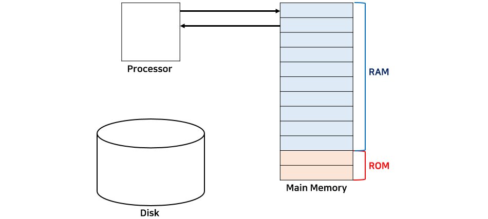
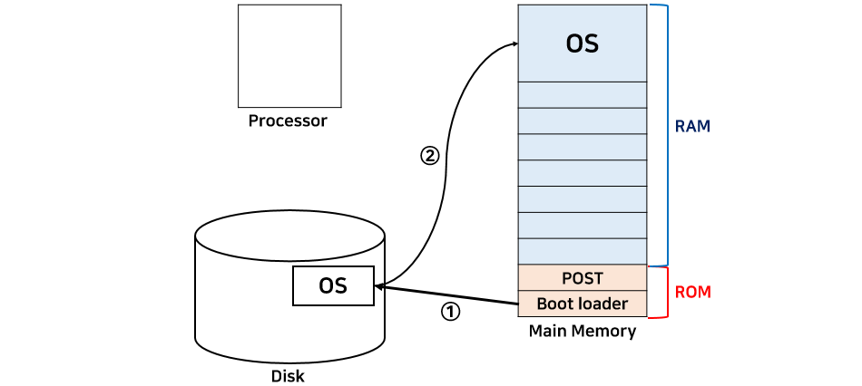

# Operating System

## 운영체제?

> 사용자가 컴퓨터를 사용하기 위해 필요한 소프트웨어

- 일반적으로 컴퓨터를 사용하면서 실행한 모든 프로그램들은 운영체제에서 관리하고 제어한다.

### 1. 운영체제 목적

1. 컴퓨터의 하드웨어 관리
2. 사용자 편의 제공

> 운영체제는 컴퓨터의 **성능을 높이고**, **사용자에게 편의성 제공**을 목적으로 하는 **컴퓨터 하드웨어 관리**를 하는 프로그램

### 2. 부팅 Booting

1. 컴퓨터의 전원이 켜지면 프로세서(CPU)에서 ROM에 있는 내용을 읽는다.
   1. ROM 안에는 POST(Power-On Self-Test), 부트 로더(Boot Loader)가 저장되어 있다.
2. POST는 전원이 켜지면 가장 처음에 실행되는 프로그램으로 현재 컴퓨터의 상태를 검사한다.
3. POST 작업이 끝나면 부트 로더가 실행된다
   1. 부트 로더는 하드디스크에 저장되어 있는 운영체제를 찾아서 메인 메모리(RAM)에 가지고 온다.

- 이러한 부트 로더의 과정을 **부팅**이라고 한다.

- **Processor**: 일반적으로 CPU를 말함
- **Main Memory**
  - **ROM**: 비휘발성으로 메모리에서 극히 일부를 차지한다.
  - **RAM**: 휘발성으로 메모리의 대부분을 차지하며 실제 프로그램이 할당되는 곳이다.

- 위와 같은 상태가 되면 운영체제가 수행할 준비를 마친 것이다.
- 운영체제가 종료하는 시점은 컴퓨터의 전원이 꺼지는 시점이다.

**커널(Kernel)과 명령어 해석기(Command interpreter, shell)**

- 운영체제는 크게 커널과 명령어 해석기로 나뉜다.
- **커널(Kernel)**: 운영체제의 핵심으로 **운영체제가 수행하는 모든 것**이 저장되어 있다.
- **명령어 해석기(Command interpreter, shell)**: 사용자가 운영체제에 요청하는 명령어를 해석하여 커널에 요청하고 그 결과를 출력함

### 3. 운영체제의 위치

- 애플리케이션은 위의 그림과 같이 운영체제 위에서 수행한다. 즉, 하드웨어 자원을 직접적으로 사용하지 않고 **운영체제가 제공하는 자원만을 사용할 수 있다.**

**운영체제는 실제 세상의 정부와 유사하다.**

<**< 정부가 하는 일 >>**

- 국토, 인력, 예산과 같은 자원이 존재하며 이를 효율적으로 사용해야 한다.
- 효율적인 자원 관리를 위해 행정부, 국토부, 교육부, 국방부 등 부서로 나눠 관리한다.
- 각 부서들은 국민들에게 자원을 요청받고 적절히 배분한다.

<**< 운영체제가 하는 일 >>**

- 프로세스, 메모리, 하드디스크 등 하드웨어 자원이 존재하고, 이를 효율적으로 사용해야 한다.
- 자원 관리를 위해 프로세스 관리, 메모리 관리, 디스크 관리, 네트워크, 보안 등 기능이 나눠져 있다.
- 애플리케이션들의 요청에 따라 각 기능들이 수행하여 적절히 자원을 분배한다.
